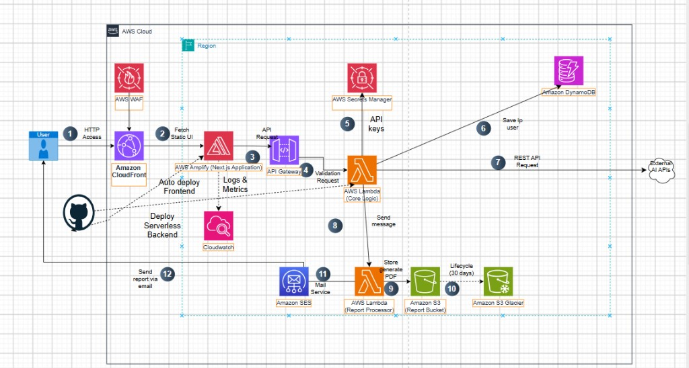

---
title: "Tổng quan"
weight: 1
chapter: true
pre: " <b> 5.1. </b> "
---

## Giới thiệu về LunaGenZ

LunaGenZ là một ứng dụng Thần Số Học sáng tạo, được thiết kế để tính toán và tạo ra các báo cáo thần số học cá nhân chi tiết. Để đảm bảo tính sẵn sàng cao, khả năng mở rộng và tối ưu chi phí, toàn bộ ứng dụng được xây dựng trên kiến trúc **Serverless của AWS**.

---

## Tổng quan Kiến trúc

Trong workshop này, bạn sẽ triển khai các thành phần sau:

### 1. Frontend (Amazon S3 & CloudFront)

Giao diện người dùng tĩnh (được xây dựng bằng HTML/CSS/JS hoặc Framework). Được lưu trữ trên S3 và phân phối toàn cầu qua CloudFront.

### 2. Backend (Amazon API Gateway & AWS Lambda)

Logic tính toán cốt lõi của thần số học được xử lý bởi các hàm AWS Lambda, được kích hoạt an toàn thông qua API Gateway.

### 3. Tạo báo cáo PDF (AWS Lambda)

Một hàm Serverless chuyên dụng tự động tổng hợp các kết quả tính toán thành một tệp báo cáo PDF có thể tải xuống.

---

## Sơ đồ Kiến trúc

---

## Luồng hoạt động

1. **Người dùng** truy cập website qua **CloudFront**
2. **CloudFront** phân phối nội dung từ **S3 Bucket**
3. Người dùng nhập thông tin (Họ tên, Ngày sinh)
4. **Frontend** gửi request đến **API Gateway**
5. **API Gateway** kích hoạt **Lambda Function**
6. **Lambda** tính toán và trả kết quả
7. Khi cần, **Lambda PDF Generator** tạo báo cáo PDF

---

## Bạn sẽ xây dựng những gì?

Cuối workshop này, bạn sẽ có một ứng dụng Serverless hoàn chỉnh đang chạy trên AWS, với:

- **Giao diện Frontend** - Giao diện HTML/CSS/JS tĩnh được host trên S3, phân phối toàn cầu qua CloudFront
- **Logic Backend** - Tính toán thần số học được xử lý bởi AWS Lambda, kích hoạt qua API Gateway
- **Tạo báo cáo PDF** - Tự động tạo báo cáo PDF có thể tải xuống bằng các hàm Serverless

---

## Các bước tiếp theo

Chuyển sang phần **Chuẩn bị** để bắt đầu.

